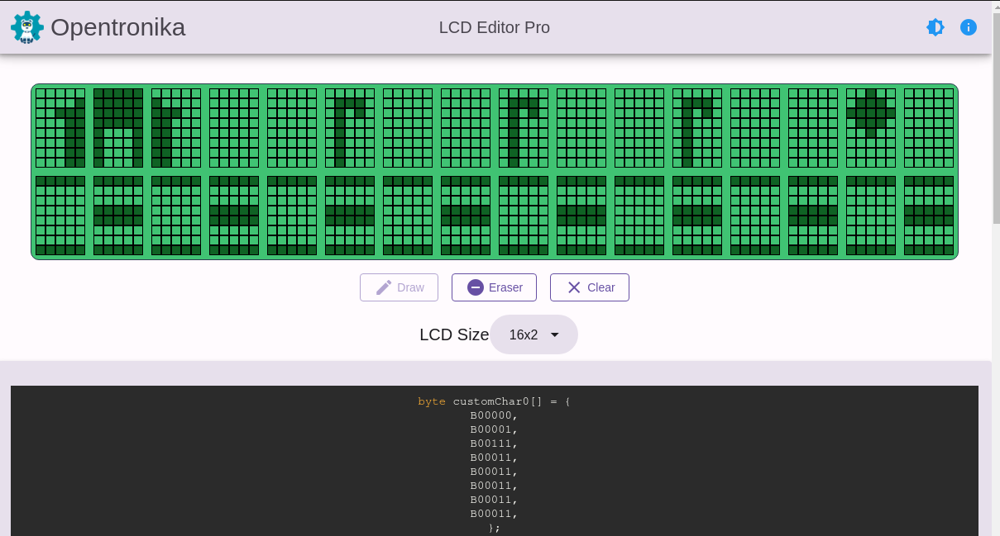

# LCD editor pro

This is a classical lcd module editor that add support for multiple characters and multiples lcd sizes. 

Make with [Vue.js](https://vuejs.org/) and [Beercss](https://www.beercss.com/).

[Linkedin](https://www.linkedin.com/in/adrian-neftali-sanchez-b027b9b7/) :)